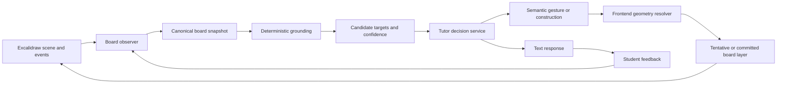

# AI Whiteboard Tutor Architecture v2

## Status

Proposed architecture.

This document describes a redesign of the AI whiteboard around the product goal of
mimicking a human tutor who shares a board with a student. It is intentionally broader
than a drawing-protocol revision. The central change is to treat the whiteboard as a
persistent, observable learning environment rather than as an image sent to a model for
coordinate generation.

The current protocol remains useful as a compatibility path. The v2 design adds a
semantic interaction layer above the existing primitive grid actions.

## 1. Product goal

The tutor should behave as if it is co-present with the student:

1. It notices what the student has just written, circled, crossed out, or pointed toward.
2. It maintains a stable understanding of the objects and relationships on the board.
3. It distinguishes student work from tutor work and temporary attention gestures.
4. It grounds its explanation in a specific object or feature.
5. It asks for clarification when the student's reference is ambiguous.
6. It uses a gesture that is attached to the intended object, not an independently guessed
   location.
7. It can revise or retract a tentative interpretation after the student responds.
8. It preserves the student's work and never silently overwrites it.

The target behavior is therefore:

```text
student action
  -> board observation
  -> candidate target grounding
  -> pedagogical intent
  -> response and gesture
  -> student feedback
  -> updated shared board state
```

The current behavior is closer to:

```text
student submits a question
  -> board screenshot
  -> model guesses coordinates
  -> primitive actions rendered
```

The second flow is the root of the system's brittleness.

## 2. Design principles

### 2.1 The browser owns exact geometry

The frontend has authoritative access to the Excalidraw scene, transforms, element
points, revisions, and user events. It should resolve semantic actions into exact scene
coordinates. The model should choose what object or feature to address, not calculate the
final pixels of the gesture.

### 2.2 The model receives structured evidence

The model should receive an image for visual context, but images should not be the only
representation of geometry. Board elements, point sequences, transforms, recent gestures,
and candidate targets should be structured input.

### 2.3 Ambiguity is a valid result

The tutor must be able to return a clarification request instead of an answer and a
possibly incorrect drawing. Confidence and competing target candidates are part of the
contract.

### 2.4 Student and tutor marks have different ownership and lifecycles

Student ink is evidence and must be protected. Tutor gestures may be temporary. Tutor
constructions may be committed. These should not all be represented as indistinguishable
native elements.

### 2.5 Board state is versioned

Every request and response must identify the board snapshot it belongs to. A delayed
response must not draw against a newer board revision without an explicit reconciliation
step.

### 2.6 Primitive drawing remains available

Freeform tutor drawings, graphs, and constructions still need lines, strokes, arcs, text,
and math. The existing v1 primitive protocol remains the fallback and is appropriate for
new diagram content. It should not be the primary mechanism for referencing existing
student work.

## 3. Current-system boundary

The current implementation is described by:

- [Whiteboard Draw Protocol v1.1](specs/whiteboard-draw-protocol-v1.md)
- [TutorBoard](../socratic-frontend/src/components/whiteboard/TutorBoard.jsx)
- [Frontend draw protocol](../socratic-frontend/src/components/whiteboard/drawProtocol.js)
- [Tutor session hook](../socratic-frontend/src/hooks/useTutorSession.js)
- [Tutor API router](../Backend/app/routers/tutor.py)
- [Whiteboard orchestrator](../Backend/app/services/ai_whiteboard_orchestrator.py)

The current flow computes a scene-space `boardRegion`, exports a stamped image, serializes
mostly bounding-box metadata, sends a 60x40 coordinate frame to the provider, and maps
returned primitives back to Excalidraw. The numerical mapping is internally consistent,
but the semantic input is weak:

- Freedraw point sequences are not sent to the backend.
- Most elements are represented by axis-aligned `gridBox` values.
- The backend accepts `boardRegion` but does not use it to validate the provider context.
- The request does not identify the latest student elements as a delta.
- The model returns absolute primitives rather than target-relative gestures.
- There is no first-class clarification or confidence result.
- A generated mark is applied immediately instead of entering a tentative gesture state.

V2 addresses those limitations without requiring an immediate replacement of the existing
provider or SSE transport.

## 4. High-level architecture



The pipeline has five distinct responsibilities:

1. **Observation**: capture the scene and student interaction history.
2. **Grounding**: identify which existing objects may be relevant.
3. **Tutoring decision**: choose explanation, clarification, gesture, or construction.
4. **Rendering**: resolve semantic commands deterministically into scene elements.
5. **Feedback**: observe the student's next action and update the shared state.

No single LLM call should be responsible for all five.

## 5. Canonical board model

The frontend should maintain a canonical snapshot at every meaningful student revision.
The existing `boardRegion` and grid remain included for compatibility, but they are no
longer the primary representation.

### 5.1 Snapshot envelope

```json
{
  "frameId": "frame-01J...",
  "revision": 42,
  "createdAt": "2026-07-21T12:00:00Z",
  "sceneRegion": {
    "x": 100,
    "y": 100,
    "width": 600,
    "height": 400
  },
  "grid": {
    "columns": 60,
    "rows": 40,
    "origin": "top-left",
    "yDirection": "down"
  },
  "image": {
    "mimeType": "image/png",
    "width": 1200,
    "height": 800,
    "data": "data:image/png;base64,..."
  },
  "elements": [],
  "latestStudentElementIds": ["s7"],
  "changedElementIds": ["s7"],
  "recentGestures": []
}
```

`frameId` identifies the coordinate frame and image. `revision` identifies the board
state. A response may be applied only when its frame and revision policy allow it.

### 5.2 Element representation

Every element should retain the existing alias and `gridBox`, then add exact geometry.
The exact shape depends on the Excalidraw type.

```json
{
  "id": "s3",
  "source": "student",
  "type": "freedraw",
  "gridBox": [10, 8, 34, 24],
  "geometry": {
    "points": [[10.2, 12.1], [11.0, 12.8], [20.4, 9.2]],
    "closed": true
  },
  "transform": {
    "angle": 0,
    "strokeWidth": 2
  },
  "content": null,
  "createdAtRevision": 37,
  "updatedAtRevision": 42
}
```

Required geometry fields by type:

| Element | Required structured geometry |
| --- | --- |
| `freedraw` | Simplified scene or grid point sequence, closed flag, stroke width |
| `line` / `arrow` | Ordered vertices, arrow direction, stroke width |
| `rectangle` | Transformed corners, rotation, visible stroke bounds |
| `ellipse` | Center, radii, rotation, visible stroke bounds |
| `text` | Text, baseline or visible bounds, font metadata |
| `image` / `math` | Visible bounds, source metadata, rotation |

The point sequence should be simplified for token efficiency, but simplification must
preserve corners, intersections, endpoints, and local curvature.

### 5.3 Semantic objects

A later perception pass may group primitives into semantic objects:

```json
{
  "id": "triangle_1",
  "kind": "triangle",
  "sourceElements": ["s1", "s2", "s3"],
  "vertices": {
    "A": [12.0, 30.0],
    "B": [30.0, 10.0],
    "C": [48.0, 30.0]
  },
  "segments": {
    "AB": {"from": "A", "to": "B"},
    "BC": {"from": "B", "to": "C"},
    "AC": {"from": "A", "to": "C"}
  },
  "confidence": 0.91
}
```

Semantic recognition must remain probabilistic and traceable. The original student
geometry remains the source of truth; inferred objects are references, not replacements.

## 6. Student gesture observation

The board observer should record events instead of waiting only for a submitted query.
The initial event types are:

- `element_created`
- `element_updated`
- `element_deleted`
- `pointer_down`
- `pointer_move`
- `pointer_up`
- `selection_changed`
- `viewport_changed`
- `query_submitted`

A normalized gesture should include:

```json
{
  "id": "gesture-12",
  "type": "circle",
  "source": "student",
  "elementIds": ["s7"],
  "points": [[21.2, 12.4], [22.0, 11.8]],
  "gridBox": [20.1, 10.2, 27.4, 18.5],
  "startedAtRevision": 41,
  "endedAtRevision": 42
}
```

The first implementation can infer gestures from new Excalidraw elements:

- Closed `freedraw` with high circularity -> `circle`
- Short stroke crossing an existing element -> `cross_out`
- Long narrow stroke near text -> `underline`
- Point or very short stroke -> `point`
- New line extending existing geometry -> `construction_attempt`

Pointer telemetry can be added later if the Excalidraw integration exposes it reliably.

## 7. Deterministic grounding

Grounding turns the latest student gesture into candidate targets before the tutor model is
called.

### 7.1 Candidate generation

For each recent gesture, calculate:

- Intersection with element geometry
- Distance to vertices
- Distance to segments and polylines
- Overlap with labels and text bounds
- Containment within shape interiors
- Recency and z-order
- Whether the target belongs to student or tutor content

Example result:

```json
{
  "gestureId": "gesture-12",
  "candidates": [
    {
      "targetId": "angle_ABC",
      "kind": "angle",
      "overlap": 0.82,
      "distance": 0.4,
      "confidence": 0.88
    },
    {
      "targetId": "vertex_B",
      "kind": "vertex",
      "overlap": 0.76,
      "distance": 0.7,
      "confidence": 0.81
    }
  ],
  "ambiguity": "medium"
}
```

### 7.2 Confidence policy

- High confidence: the tutor may refer to or tentatively gesture at the target.
- Medium confidence: the tutor may mention the likely target and ask for confirmation.
- Low confidence: the tutor should ask the student to identify the intended part.

The confidence threshold must be configurable and logged for evaluation.

## 8. Tutor decision contract

The LLM should return a structured tutoring decision rather than directly emitting only
primitive draw actions.

```json
{
  "decision": "annotate_target",
  "confidence": 0.93,
  "target": {
    "id": "angle_ABC",
    "feature": {
      "kind": "angle",
      "vertex": "B"
    }
  },
  "spokenResponse": "Let us look at the angle at B. The two rays forming it are ...",
  "commands": [
    {
      "type": "gesture",
      "gesture": "circle",
      "target": "angle_ABC",
      "temporary": true,
      "style": "attention"
    }
  ],
  "requiresConfirmation": false,
  "reasoningSummary": "The student's latest circle overlaps the angle at B."
}
```

Supported decisions should include:

- `answer_without_drawing`
- `annotate_target`
- `construct_geometry`
- `label_target`
- `clarify_reference`
- `acknowledge_student_work`
- `decline_visual_action`

`reasoningSummary` is for telemetry and debugging. It should not be shown to the student
by default.

### 8.1 Clarification response

```json
{
  "decision": "clarify_reference",
  "confidence": 0.54,
  "candidates": ["angle_ABC", "segment_AC"],
  "spokenResponse": "Do you mean the angle at B or the horizontal segment AC?",
  "commands": [
    {
      "type": "gesture",
      "gesture": "halo_candidates",
      "targets": ["angle_ABC", "segment_AC"],
      "temporary": true
    }
  ],
  "requiresConfirmation": true
}
```

Clarification is a normal teaching action, not an error fallback.

## 9. Semantic command protocol

Semantic commands are resolved by the frontend. They are separate from the v1 primitive
`draw_actions` tool.

### 9.1 Target gestures

```json
{
  "type": "gesture",
  "gesture": "circle",
  "target": "angle_ABC",
  "temporary": true,
  "padding": 1.5,
  "style": "attention"
}
```

Initial gesture types:

- `circle`
- `halo`
- `point`
- `underline`
- `highlight_segment`
- `cross_out`
- `label_near`
- `erase_tutor_gesture`

### 9.2 Feature selectors

Targets may resolve to an object or a feature within an object:

```json
{
  "target": "s3",
  "feature": {
    "kind": "segment",
    "index": 2
  }
}
```

```json
{
  "target": "triangle_1",
  "feature": {
    "kind": "vertex",
    "label": "B"
  }
}
```

```json
{
  "target": "s7",
  "feature": {
    "kind": "nearest_point",
    "hint": [24.2, 15.7]
  }
}
```

### 9.3 Constructions

Constructions should be declarative where possible:

```json
{
  "type": "construction",
  "kind": "line",
  "from": "vertex_B",
  "constraint": "parallel_to:segment_AC",
  "temporary": false
}
```

The frontend or a geometry service should compute the resulting points. Absolute grid
strokes remain available when a construction cannot be represented declaratively.

## 10. Frontend rendering and lifecycle

### 10.1 Resolution

The frontend resolves commands using the canonical snapshot that produced the request:

1. Verify `frameId` and revision policy.
2. Resolve the target alias or semantic object.
3. Resolve the requested feature.
4. Compute exact scene-space bounds or points.
5. Apply visual padding and style.
6. Create native Excalidraw elements.
7. Stamp ownership and lifecycle metadata.

For example, `circle` around a vertex should use the actual vertex position and a radius
based on the local geometry, rather than an ellipse guessed in global grid space.

### 10.2 Lifecycle metadata

AI-created elements should carry metadata such as:

```json
{
  "customData": {
    "source": "ai",
    "layer": "tutor-gesture",
    "lifecycle": "tentative",
    "frameId": "frame-01J...",
    "targetId": "angle_ABC",
    "createdAtRevision": 42
  }
}
```

Recommended layers:

- `student`: student-created work; protected from AI erase.
- `tutor-gesture`: temporary pointer, halo, circle, or highlight.
- `tutor-construction`: committed mathematical construction.
- `tutor-label`: explanatory text or math.

### 10.3 Tentative versus committed marks

Tentative marks should be visually distinct and removable without affecting student undo
history. They may be committed when:

- The tutor has high confidence.
- The student confirms the target.
- The next turn references the same target without correction.

The UI should support replacing a tentative gesture rather than accumulating incorrect
circles on the board.

## 11. Transport and backend changes

The existing `POST /api/ai-tutor/process-query` endpoint and SSE transport can remain in
place during migration.

### 11.1 Request additions

Add a versioned snapshot envelope or extend the existing request with:

```json
{
  "boardSnapshot": {
    "frameId": "frame-01J...",
    "revision": 42,
    "sceneRegion": {},
    "grid": {},
    "elements": [],
    "latestStudentElementIds": [],
    "changedElementIds": [],
    "recentGestures": [],
    "image": {}
  }
}
```

During compatibility mode, continue populating `canvasImage`, `boardRegion`, and
`boardElements` from this envelope.

### 11.2 SSE additions

Add semantic events while retaining existing `text`, `draw`, `state`, `done`, and `error`:

| Event | Purpose |
| --- | --- |
| `decision` | Tutor decision and confidence metadata |
| `gesture` | Semantic gesture command resolved or pending |
| `clarification` | Explicit request for student confirmation |
| `draw` | Legacy primitive action |
| `state` | Updated tutoring state |
| `done` | Terminal success |
| `error` | Terminal failure |

Every visual event should include:

```json
{
  "frameId": "frame-01J...",
  "revision": 42,
  "index": 0
}
```

### 11.3 Backend responsibilities

The backend should:

- Validate snapshot schema and size limits.
- Ensure frame metadata is internally consistent.
- Preserve the snapshot or a compact semantic summary with the tutoring session.
- Pass candidate targets and recent gestures into the tutor decision stage.
- Validate semantic command schemas.
- Continue validating legacy primitive actions.
- Persist the tutor decision, confidence, target, and whether the student corrected it.

The backend should not attempt to convert semantic target commands into Excalidraw scene
coordinates. That is owned by the frontend, which has the authoritative live scene.

## 12. Tutoring state additions

The rolling `TutoringState` should gain visual context:

```json
{
  "activeTarget": {
    "id": "angle_ABC",
    "kind": "angle",
    "lastConfirmedRevision": 42
  },
  "pendingClarification": {
    "candidateIds": ["angle_ABC", "segment_AC"],
    "askedAtRevision": 42
  },
  "lastStudentGesture": {
    "type": "circle",
    "elementId": "s7"
  },
  "tentativeTutorMarks": ["ai-gesture-3"]
}
```

This allows the tutor to continue referring to the same angle or segment across turns
without rediscovering it from a new image.

## 13. Failure and recovery behavior

### Stale response

If the board revision changed while a request was in flight:

1. Do not blindly apply semantic gestures.
2. Re-resolve the target against the current scene if the target ID still exists.
3. Otherwise discard the command and request a fresh turn or clarification.

### Unknown target

If a target cannot be resolved:

- Keep the spoken response if it is still valid.
- Do not render a detached gesture.
- Emit a telemetry event with the unresolved target.

### Ambiguous target

Return a clarification decision. Do not use a random candidate and do not silently fall
back to an absolute ellipse.

### Provider or parsing failure

Continue to support the current behavior:

- Text may complete without a drawing.
- Invalid primitive actions are dropped individually.
- The stream ends with `done` or `error`.
- The frontend must stop processing and preserve the board.

### Student work protection

AI commands may never delete or mutate student-owned elements. Target-relative erase is
restricted to tutor gesture and tutor construction layers.

## 14. Evaluation strategy

Coordinate round-trip tests are necessary but insufficient. Add behavior-level fixtures.

### 14.1 Grounding metrics

- Correct target object rate
- Correct feature rate: vertex, segment, angle, label
- Top-1 and top-2 candidate accuracy
- Clarification precision
- False confident interpretation rate

### 14.2 Rendering metrics

- Gesture-target overlap
- Distance from rendered anchor to target feature
- Detached annotation rate
- Stale-response rejection rate
- Student-work mutation rate

### 14.3 Tutor behavior metrics

- Appropriate clarification rate
- Percentage of responses grounded in the latest student action
- Tentative gesture correction rate
- Number of unnecessary drawings per turn
- Student confirmation and correction rate

### 14.4 Required fixtures

Add fixtures covering:

- Student circles a triangle vertex.
- Student circles an angle region.
- Student underlines an equation term.
- Student crosses out one construction.
- Multiple nearby candidate segments.
- Rotated and partially overlapping elements.
- A stale response after the student edits the board.
- An empty board with a new tutor construction.

## 15. Migration plan

### Phase 0: Instrument the existing system

- Add board `revision` and `frameId`.
- Record image dimensions and MIME type.
- Log latest student element IDs and request/response frame metadata.
- Add real-board screenshot fixtures.
- Measure detached annotation rate.

No model or protocol behavior changes are required in this phase.

### Phase 1: Rich board listing

- Send point sequences, transforms, stroke widths, and exact visible bounds.
- Send `latestStudentElementIds`, `changedElementIds`, and recent gesture summaries.
- Keep `gridBox` and all v1 primitive actions.
- Update the provider prompt to prefer structured geometry over visual coordinate guesses.

### Phase 2: Deterministic grounding

- Add frontend geometry utilities for nearest point, nearest segment, vertex, overlap,
  and local bounds.
- Generate candidate targets before the tutor call.
- Include confidence and candidates in the provider context.
- Add ambiguity logging without changing visible behavior initially.

### Phase 3: Semantic gestures

- Add `gesture` and `decision` schemas.
- Implement `circle`, `point`, `highlight_segment`, `underline`, and `label_near`.
- Resolve commands in the frontend.
- Fall back to v1 primitives when a target cannot be resolved.

### Phase 4: Clarification and lifecycle

- Add explicit `clarify_reference` responses.
- Render tentative gestures in a separate layer.
- Add confirmation, replacement, and dismissal behavior.
- Persist active targets and pending clarifications in tutoring state.

### Phase 5: Semantic geometry

- Recognize common objects such as triangles, circles, lines, rays, angles, and equations.
- Add declarative constructions and named features.
- Evaluate geometry-specific tutoring tasks against human-labeled fixtures.

## 16. Immediate implementation slice

The smallest high-value slice is:

1. Add exact point geometry to `boardElements`.
2. Add `latestStudentElementIds` and `revision` to the request.
3. Add a deterministic `circle_target` command.
4. Resolve `circle_target` in `TutorBoard` from the actual target points.
5. Keep all existing primitive actions unchanged.
6. Add tests for circling a vertex, circling a segment, and rejecting a stale frame.

This slice directly addresses the motivating failure while creating the foundation for
clarification, semantic geometry, and a more human tutoring loop.

## 17. Architectural success criterion

The system is successful when a student can draw or circle a part of a geometry problem
and the tutor reliably does one of three things:

1. Identifies and gestures at the intended feature.
2. Asks a concise clarification question when multiple features are plausible.
3. Explains that the visual evidence is insufficient and asks the student to mark it more
   clearly.

A visually polished but incorrectly placed annotation is not a successful tutor turn.
